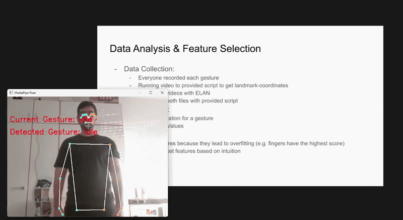
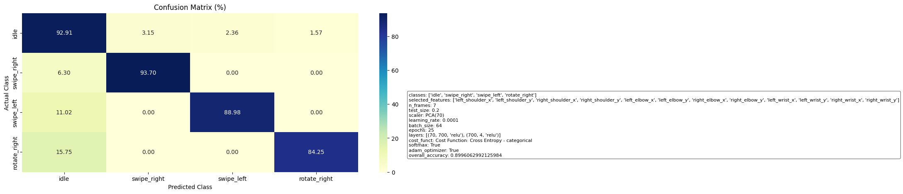

# Gesture-Controlled Presentation System

Control your slides using hand gestures in real time.

---

## ✨ How It Works

* Your webcam captures body landmarks using MediaPipe
* These landmarks are converted into structured feature data
* A trained neural network predicts the current gesture
* The predicted gesture is sent to a local server
* The server broadcasts the command to the browser
* The slideshow reacts

### Supported Gestures

* `swipe_right` -> next slide
* `swipe_left` -> previous slide
* `rotate_right` -> rotate current image

---

## 🎬 Demo

Below is a demonstration of the system in action:



---

## ⚙️ Setup

### 1. Install dependencies

```bash
pip install -r requirements.txt
```

---

### 2. Train the model

```bash
python train.py
```

⚠️ Important:

* The training data was created by:

  * Recording videos
  * Extracting pose landmarks using MediaPipe
  * Annotating gestures using the **ELAN annotation tool**
* This process produces CSV files used for training

Due to their large size, these datasets are **not included** in the repository.

If you don’t have your own dataset, you can use the **pre-trained model** located in:

```text
trained_models/
```

---

### 3. Run the slideshow server

```bash
python slideshow/slideshow_demo.py
```

Then open:

```text
http://127.0.0.1:8000
```

---

### 4. Run gesture control

In a separate terminal:

```bash
python prediction_mode.py
```

Now control the slides with your hand gestures!

---

## 📊 Model Performance

The model is evaluated using a confusion matrix to visualize classification performance across gesture classes.



---

## 🧠 Notes

* The model uses a **multi-frame approach** (sequence of frames) to better capture motion
* Feature normalization improves robustness across different users
* Performance depends on:

  * lighting conditions
  * camera quality
  * user distance from camera

* This project is for educational purposes.
---


